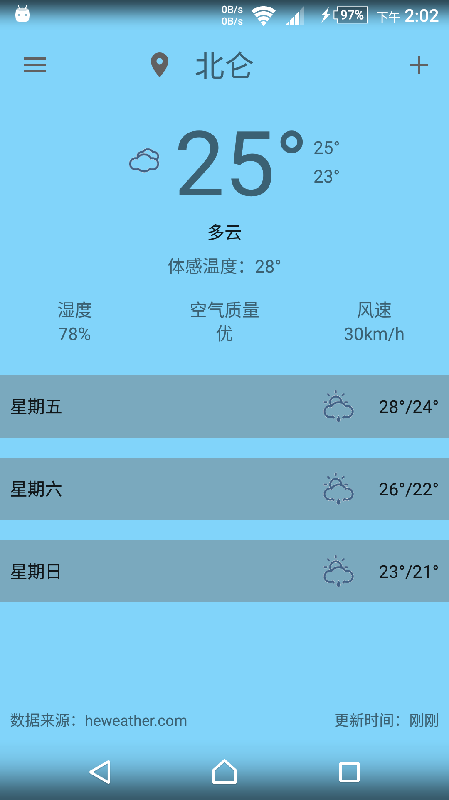
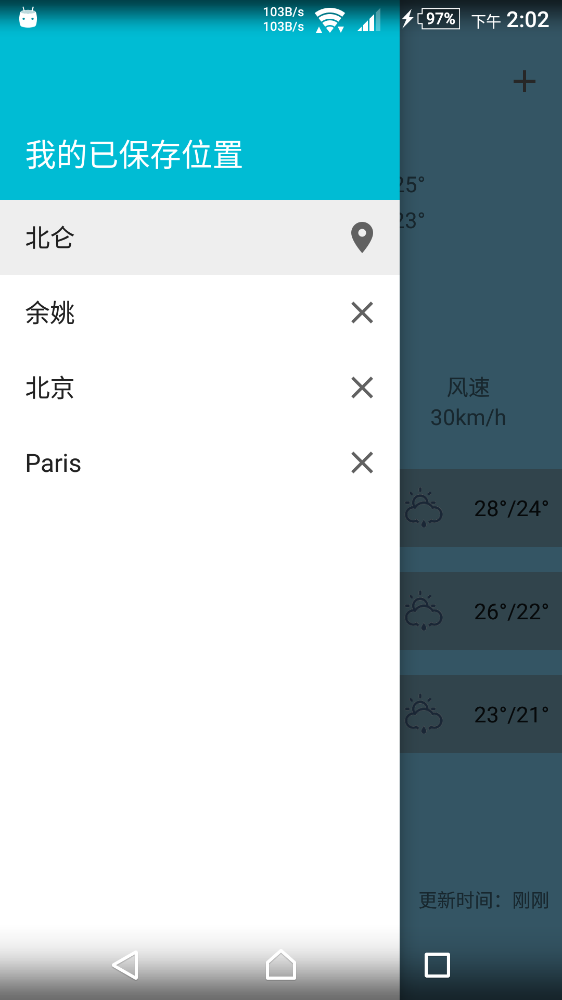
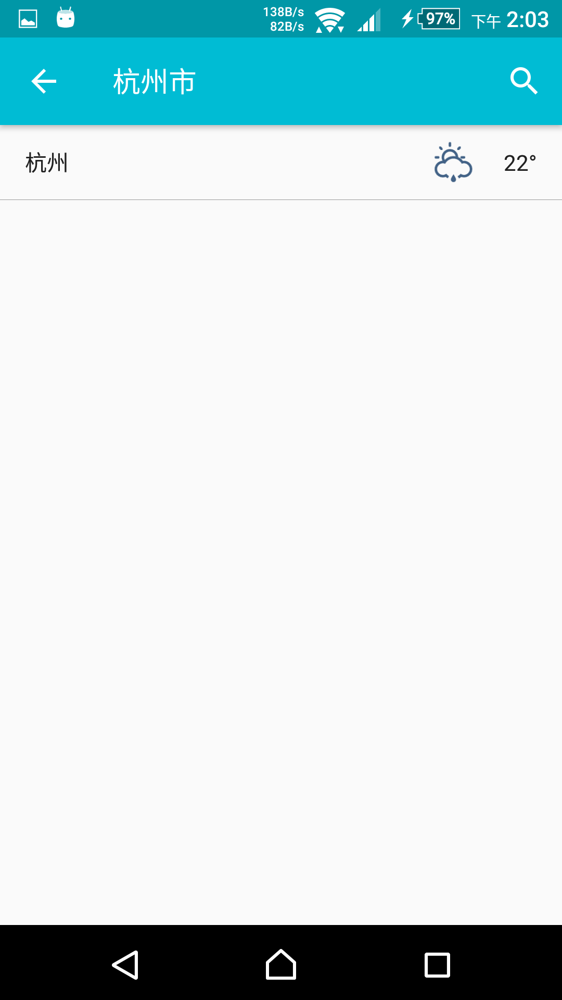

#Weather
天气预报

## API来源
  [和风天气](http://www.heweather.com/)

## 截屏

## 关于我
  邮箱：iamyining@yahoo.com 
   
  [知乎主页](https://www.zhihu.com/people/undefeated)
## 许可证

    Copyright 2016 Yining Huang

    Licensed under the Apache License, Version 2.0 (the "License");
    you may not use this file except in compliance with the License.
    You may obtain a copy of the License at

        http://www.apache.org/licenses/LICENSE-2.0

    Unless required by applicable law or agreed to in writing, software
    distributed under the License is distributed on an "AS IS" BASIS,
    WITHOUT WARRANTIES OR CONDITIONS OF ANY KIND, either express or implied.
    See the License for the specific language governing permissions and
    limitations under the License.
